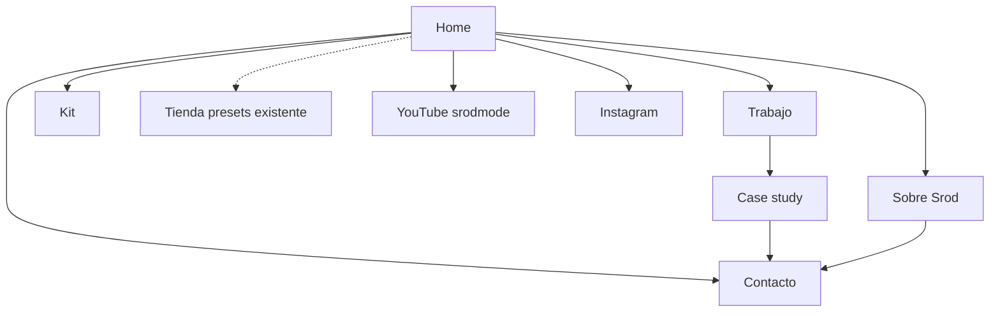

# Especificación: laboratorio web Srod Almenara

Documento de producto y técnica para el desarrollador. Idioma del producto: **español**.

| | |
|---|---|
| **Sitio oficial** | [srodalmenara.com](https://www.srodalmenara.com/) |
| **Canal (identidad visual)** | [YouTube @srodmode](https://www.youtube.com/c/srodmode) |
| **Referencia actual** | Squarespace + tienda. Usarla como respaldo de contenidos y enlaces, **no** como diseño. |
| **Fase** | 1 — laboratorio público; sin e-commerce nuevo |
| **Estado** | Spec aprobada. Implementar el lab a partir de este documento. |

---

## 1. Qué es este sitio

Marca personal completa: **quién es, qué hace, dónde encontrarlo**. No hay una sola conversión dominante (no es landing de venta, ni fanpage, ni site de agencia).

El visitante principal es un **cliente profesional** (productora, marca, fotógrafo que podría contratarlo). Los fans de YouTube/Instagram son bienvenidos, pero el tono, el orden y el look se diseñan para el primero.

Identidad profesional: **híbrido**. Srod es DP de verdad **y** creador geek; la personalidad de [@srodmode](https://www.youtube.com/c/srodmode) es credencial, no un apéndice al footer.

Tono: **tech-nerd**. El geek es oficio (cámaras, lentes, color, proceso), preciso, de alguien que sabe lo que hace. No humor de influencer ni pose de agencia.

Metáfora de producto: **laboratorio público de un DP**, no tarjeta de visita. Incluye case studies con ficha, kit con “por qué”, y una ventana viva al canal. No es un blog educativo paralelo.

Fuera de alcance en esta web:

- E-commerce / presets (se quedan en el sitio actual, enlazados).
- Agenda de eventos (solo menciones ligeras).
- Portfolio musical (la música se menciona en About; no hay look ni sección de músico).

---

## 2. Audiencia y promesa

- **Primario:** quien podría contratarlo. Debe entender oficio, ver 3–8 trabajos profundos, leer (si quiere) la ficha técnica, y contactar por formulario.
- **Secundario:** audiencia del canal. Debe reconocer el universo de cámaras/tutoriales, ir a YouTube/Instagram, y sentir el lab como extensión del canal, no como merch store.

Ubicación: **basado en Panamá**, disponible también **remoto / internacional**. Eso vive en About y contacto, **no** en el gancho del hero.

---

## 3. Identidad verbal y visual

### Verbal

- Conservar el espíritu del tagline actual (*“Un DP bien geek que hace videos en YouTube”*), **evolucionar la frase**.
- El hero debe decir: DP + geek + cámaras/proceso. YouTube es prueba, no la definición entera.
- Titular y subtítulo **editables en CMS**. Placeholder de lanzamiento: evolución del tagline (copy a proponer en diseño, Srod lo ajusta).
- Toda la UI en español. Créditos de equipo pueden usar nombres de industria (Sony FX3, etc.).

### Visual

- Look **claro / galería**: fondos claros, aire, foto y video en cajas limpias. Más estudio que set de noche.
- **No** copiar el sitio actual (casi no tiene sistema).
- Guiarse por la **identidad del canal YouTube** @srodmode (thumbnails, intro, paleta del canal, ritmo gráfico). Extraer paleta, acentos y tipo a partir de ese material; sistematizarlos para web clara.
- Wordmark: “Srod Almenara”. Logo ilustrado no obligatorio.
- Música: cero contaminación visual del canal de guitarra.

### Motion

- **Cinemático:** hero con video, transiciones de página tipo corte/fade, parallax suave, sensación de entrar a un reel.
- Sobre UI luminosa (el contraste es intencional: estudio claro + ritmo de cine).
- Obligatorio: `prefers-reduced-motion` (cortar parallax y transiciones largas).
- Rendimiento móvil: video lazy, poster still, no autoplay con sonido, no bloquear LCP.

---

## 4. Arquitectura de información

### Páginas

| Ruta | Rol |
|------|-----|
| `/` | Hero cinemático, extracto About, destacados de trabajo, grid IG, ventana YouTube, kit teaser, mención ligera “dónde encontrarme”, CTA contacto |
| `/trabajo` | Índice de 3–8 case studies (no grid masivo de thumbs) |
| `/trabajo/[slug]` | Case: capa cliente + toggle ficha técnica |
| `/kit` | Equipo con el “por qué” |
| `/sobre` | Bio completa, retrato, origen, cómo trabaja, para quién, mención música, ubicación Panamá + remoto |
| `/contacto` | Formulario + email visible de respaldo + redes núcleo |
| `/privacidad` | Privacidad mínima (formulario) |
| Footer global | YT, IG, otras redes discretas, enlace a tienda, enlace opcional música, privacidad mínima |

No hay página `/eventos` ni `/blog` ni `/presets` nuevas. `/presets` o `shop.srodalmenara.com` apunta al **sitio viejo** hasta que se decida migrar la tienda.

Navegación header (compacta): Trabajo, Kit, Sobre, Contacto + iconos YT/IG. Wordmark home.

---

## 5. Contenido por superficie

### Home

- Hero: video YouTube (no listado o público) en player discreto + nombre + titular evolucionado (CMS).
- Extracto About + enlace a `/sobre`.
- 2–3 case studies destacados (no todos).
- Grid de últimos posts de Instagram.
- Ventana YouTube: últimos N videos + botón al canal.
- Teaser de kit (2–3 piezas con “por qué”) + enlace `/kit`.
- Bloque CMS de texto corto “dónde encontrarme” (mención ligera; puede estar vacío).
- CTA a `/contacto` (no agresivo).

### Case studies (núcleo)

Cantidad objetivo: **3–8**, profundos. Lanzamiento del *build* con placeholders de calidad; Srod sustituye en CMS antes de publicar.

**Capa cliente (default):** título, cliente/proyecto, rol de Srod, año, video, galería de stills, resultado/contexto corto.

**Capa geek (toggle “Ficha técnica”):** cámara, lentes, iluminación, look/color, notas de “por qué”, otros datos opcionales (codec, pipeline) si el proyecto los tiene.

Modelo CMS flexible: campos base obligatorios + bloques opcionales. El toggle es de UI, no dos URLs.

Video: **YouTube** público o no listado. Embed con chrome mínimo (`modestbranding`, sin related si la API lo permite, sin autoplay con audio). Distinto de la sección proceso (feed del canal).

### Kit

Lista de piezas importantes (cámara, lentes, luces, monitor, audio si aplica). Cada una: nombre, foto opcional, **nota corta de para qué la usa**. No es catálogo con specs de fabricante. Editable en CMS; orden manual.

### Proceso / YouTube

No hay blog ni recatalogación. Bloque: **últimos N videos del canal** (oEmbed/API) + CTA “Ver el canal”. N configurable (sugerido 6–9). Si el fetch falla, degradar a CTA al canal.

### About

Origen, cómo trabaja, personalidad geek, para quién es su DP, retrato. Panamá + disponibilidad remota/internacional. **Una mención** a la música como parte de quién es (link footer o inline), sin galería musical.

### Contacto

Formulario **sin login**, envío a email de Srod (CMS o env), CC opcional a Luis.

Campos: nombre, email, organización, tipo de proyecto, fechas, mensaje.

Email de respaldo visible (`srod@srodalmenara.com` o el que confirme Srod), clic para copiar + mailto.

Aunque no se eligió explícitamente, el desarrollador **debe** incluir anti-spam (honeypot + Turnstile o equivalente) y una línea de privacidad: los datos solo se usan para responder. Página `/privacidad` mínima.

### Redes

- Núcleo: YouTube + Instagram (header, home, contacto).
- Resto: footer.
- Instagram: **grid de últimos posts** en home y/o about (widget/servicio mantenido; la API oficial de Meta exige app review). Documentar renovación de token. Si el grid cae, quedan los enlaces fuertes.
- Tienda: enlace footer/home discreto “Presets” → sitio actual.

---

## 6. CMS y operaciones

Srod (o alguien de su equipo) edita **sin código**: proyectos, kit, about, titular, bloque eventos, email de contacto, destacados de home.

El desarrollador entrega el sitio **completo con placeholders** (copy, stills, videos dummy coherentes con el look). Publicación real cuando Srod rellene el CMS.

### Modelos

| Modelo | Uso |
|--------|-----|
| `siteSettings` | Globals del sitio |
| `project` | Case studies |
| `kitItem` | Piezas de kit |

### Campos de sitio (`siteSettings`)

- Titular / subtítulo (hero)
- Email de contacto
- URL YouTube / Instagram
- N de videos del feed
- Texto “dónde encontrarme” (puede estar vacío)
- Enlace tienda (presets / sitio actual)
- Enlace música (opcional)
- CC del formulario
- Destacados de home (2–3 proyectos)
- Teaser de kit (2–3 piezas)
- Extracto About

### Campos de proyecto (`project`)

**Obligatorios (capa cliente):** título, slug, cliente/proyecto, rol de Srod, año, video (YouTube), galería de stills, resultado/contexto corto.

**Opcionales (capa geek / ficha técnica):** cámara, lentes, iluminación, look/color, notas de “por qué”, codec, pipeline, otros bloques.

Orden y “destacado en home” editables.

### Campos de kit (`kitItem`)

Nombre, foto opcional, nota corta de para qué la usa, orden manual.

---

## 7. SEO, analítica, legal

- SEO en español: title/description únicos, OG/Twitter cards con still del hero o del case, sitemap, `robots.txt`, slugs en español, JSON-LD `Person` + `CreativeWork` en cases.
- Keywords de marca + oficio (director de fotografía, cinematógrafo, color, Panamá) **sin** convertir el hero en SEO local.
- Analítica: **Plausible o Umami** (sin cookies de marketing). No Google Analytics.
- Formulario: privacidad mínima + anti-spam.

---

## 8. Stack recomendado

Elegido por ser el estándar actual para este tipo de site (motion, CMS, video, SEO). Sin ataduras del cliente; el desarrollador puede sustituir equivalentes si mantiene el resultado.

| Pieza | Elección | Rol |
|-------|----------|-----|
| App | **Next.js (App Router) + TypeScript** | Páginas, metadata, ISR para cases |
| Estilos | **Tailwind CSS** | Sistema de tipo/espacio de galería clara |
| Motion | **Motion** (ex Framer Motion) y/o **GSAP** | Transiciones de ruta tipo corte/fade y reveal; no WebGL |
| CMS | **Sanity** (o Payload si se prefiere self-hosted) | Modelos `project`, `kitItem`, `siteSettings`; Studio para Srod |
| Hosting | **Vercel** | Hosting, preview deploys, ISR |
| Correo | **Resend** (o similar) | Envío del formulario |
| YouTube | **YouTube Data API o RSS del canal** | Últimos N videos; iframes para players |
| Instagram | **Widget** (p. ej. Behold u otro que sobreviva a la API de Meta) | Grid; documentar plan B y renovación de token |
| Analítica | **Plausible o Umami** | Sin cookies de marketing |
| Anti-spam | **Cloudflare Turnstile** + honeypot | Formulario |

La tienda vieja **no se reescribe**. Cutover DNS: `srodalmenara.com` → Vercel; preservar `/presets` o `shop.` hacia Squarespace (o redirect) para no romper compras.

---

## 9. Calidad de implementación

- Responsive desde 360px; el motion se simplifica en móvil, el contenido no.
- Accesibilidad: foco visible, contraste en UI clara, labels del form, botones de play reales, toggle de ficha usable con teclado.
- Video: posters, no layout shift, no descargar 4K en 4G.
- Diseño a partir de audit del canal (paleta, thumbnails, intro); entregar tokens (color, tipo, radio, sombra de “caja de galería”).
- Placeholders deben parecer sitio real (no lorem rosa).

---

## 10. Fuera de alcance (fase 1)

- Checkout, carrito, entrega de presets.
- Calendario de eventos, blog, i18n, dark mode, app, login de clientes.
- Rebrand del canal de música.
- Migrar el dominio de tienda hasta que Srod decida.

---

## 11. Criterios de aceptación

Un cliente profesional puede, en una visita:

1. Entender a qué se dedica Srod.
2. Ver un case con video y stills.
3. Abrir la ficha técnica.
4. Entender el kit.
5. Ir a YouTube e Instagram.
6. Enviar el formulario.

Además:

- Un fan reconoce el canal y el look.
- Srod puede cambiar un proyecto, una pieza de kit y el titular **sin deploy**.
- En móvil se ve y se mueve bien.
- La tienda vieja sigue alcanzable.
- No hay e-commerce nuevo ni sección de música.
